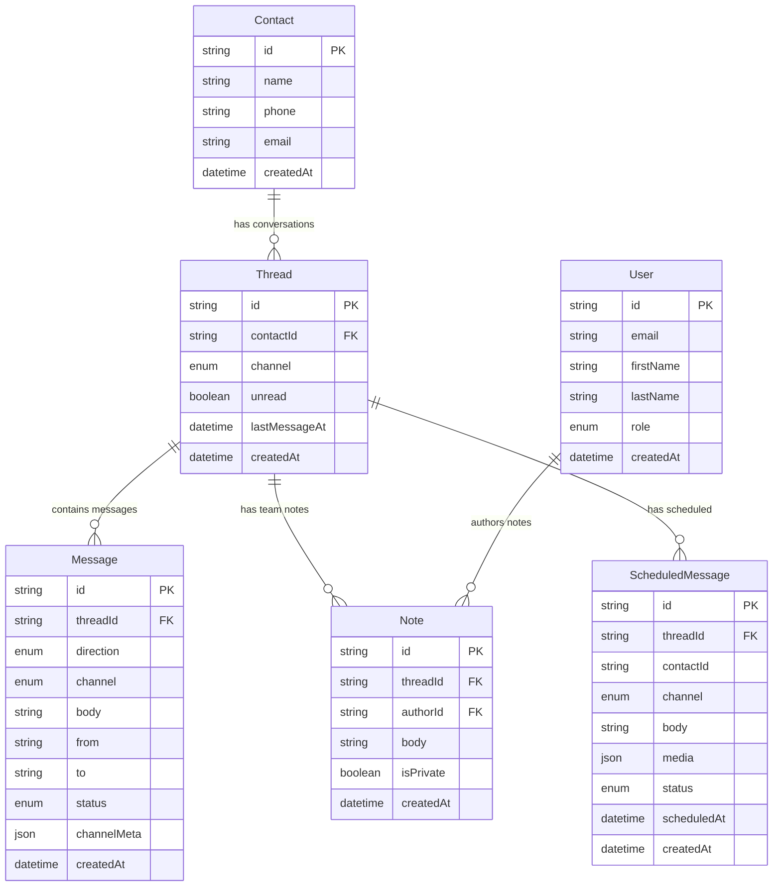

# Unified Inbox

A unified communication platform that consolidates messages from multiple channels (SMS, WhatsApp, Email) into a single inbox interface.

## Application Flow

### User Journey

```
┌─────────────────┐    ┌──────────────────┐    ┌─────────────────┐
│   User Login    │───▶│   Dashboard      │───▶│   Inbox View    │
│   /login        │    │   /(dashboard)   │    │   /inbox        │
└─────────────────┘    └──────────────────┘    └─────────────────┘
                                │
                                ▼
┌─────────────────┐    ┌──────────────────┐    ┌─────────────────┐
│   Contacts      │    │   Analytics      │    │   Settings      │
│   /contacts     │    │   /analytics     │    │   /settings     │
└─────────────────┘    └──────────────────┘    └─────────────────┘
```

### Message Processing Flow

#### Inbound Messages

```
Twilio/WhatsApp → Webhook → API Route → Database → Real-time UI Update
```

1. External service receives message
2. Webhook triggers API endpoint (`/api/webhooks/twilio/*`)
3. Message stored in database with thread association
4. UI updates in real-time via TanStack Query

#### Outbound Messages

```
User Compose → Validation → Channel Integration → Send → Status Tracking
```

1. User composes message in inbox interface
2. Message validated and queued
3. Channel-specific sender processes message
4. Delivery status tracked and displayed

#### Scheduled Messages

```
User Schedule → Database Storage → Cron Job → Channel Send → Status Update
```

1. User schedules future message
2. Stored in `ScheduledMessage` table
3. Cron job (`/api/jobs/sendScheduled`) processes pending messages
4. Message sent via appropriate channel
5. Status updated in database

### Data Flow Architecture

#### Core Entities

- **Users**: Authentication and role-based access
- **Contacts**: Customer profiles with communication preferences
- **Threads**: Conversation containers grouped by contact and channel
- **Messages**: Individual message records with delivery status
- **ScheduledMessages**: Future message delivery queue
- **Notes**: Internal team collaboration on conversations

#### API Structure

```
/api/
├── auth/              # User authentication
├── contacts/          # Contact CRUD operations
├── messages/          # Message management
├── scheduled-messages/ # Future message handling
├── webhooks/          # External service integration
├── jobs/              # Background processing
├── analytics/         # Usage metrics
└── users/             # User management
```

### Technology Stack

- **Frontend**: Next.js 16 (App Router) + React 19 + TypeScript
- **Backend**: Next.js API routes + Prisma ORM
- **Database**: PostgreSQL with migrations
- **Authentication**: Better Auth with sessions
- **Messaging**: Twilio SDK for SMS/WhatsApp
- **State**: TanStack Query + Zustand
- **UI**: Tailwind CSS + Radix UI components
- **Deployment**: Vercel with cron jobs

### Key Features

- **Multi-channel Support**: Unified SMS, WhatsApp, and Email messaging
- **Real-time Updates**: Live message synchronization
- **Message Scheduling**: Send messages at future times
- **Contact Management**: Centralized customer profiles
- **Team Collaboration**: Internal notes and role-based permissions
- **Analytics Dashboard**: Communication insights and metrics

## Integration Comparison

| Channel      | Latency | Cost per Message | Reliability | Character Limit | Media Support |
| ------------ | ------- | ---------------- | ----------- | --------------- | ------------- |
| **SMS**      | ~1-3s   | $0.0075          | 99.9%       | 160 chars       | ❌            |
| **WhatsApp** | ~1-2s   | $0.005           | 99.5%       | 4096 chars      | ✅            |

### Key Technical Decisions

- **Twilio Integration**: Chosen for unified SMS/WhatsApp API and global reach
- **PostgreSQL**: Selected for ACID compliance and complex relationship handling
- **Better Auth**: Implemented for secure authentication with role-based access
- **Zod Validation**: Used for type-safe validation across client and server
- **TanStack Query**: Adopted for optimized caching and real-time updates
- **Vercel Deployment**: Chosen for seamless Next.js integration and cron jobs

## System Architecture

### Entity Relationship Diagram



### Data Flow

1. **Inbound Messages**: Twilio → Webhook → Database → Real-time UI
2. **Outbound Messages**: UI → Validation → Twilio API → Database → Status Update
3. **Scheduled Messages**: UI → Database → Cron Job → Twilio API → Status Update
4. **Team Notes**: UI → Database → Supabase Real-time → UI Updates

## Contributing

To set up the project locally, contribute code, or deploy the application, see our detailed [CONTRIBUTION.md](./CONTRIBUTION.md) guide.
